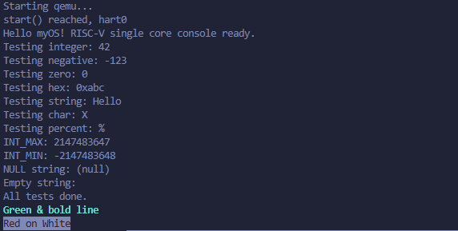
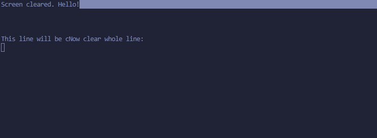

# 实验 2：内核 printf 与清屏功能实现

## 1. 实验概述

本实验在实验 1 的基础上，进一步完善操作系统的输出系统。实现了支持可变参数的格式化输出函数 `printf`，以及基于 ANSI 转义序列的清屏和颜色控制功能。通过分层设计（驱动层 -> 控制台层 -> 格式化层），构建了功能完备的内核打印机制。

## 2. 新增关键文件

```text
kernel/
├── lib/
│   ├── printf.c    # 核心格式化输出实现 (%d, %x, %s, %c, %p)
│   └── ansi.c      # ANSI 转义序列封装：清屏、光标移动、颜色设置
├── devs/
│   └── consloe.c   # 控制台抽象层：处理退格、回车及输入回显
└── boot/
    └── main.c      # 综合测试用例 (包含边界条件测试)
```

## 3. 核心实现原理

### 3.1 格式化输出 (printf.c)

- **可变参数处理**: 使用 `<stdarg.h>` 中的 `va_list` 处理不定长参数。
- **状态机解析**: 遍历格式字符串，识别 `%` 标志并解析后续格式符（d, x, p, s, c）。
- **数字转换算法**:
  - 实现了 `print_number` 函数，支持 10 进制和 16 进制。
  - **负数处理技巧**: 将负数强制转换为 `unsigned int` 后处理，避免了 `INT_MIN` (-2147483648) 直接取反导致的溢出问题。
- **Panic 机制**: 实现了 `panic()` 函数，用于打印错误信息并挂起系统（死循环）。

### 3.2 控制台与 ANSI 支持

- **控制台层 (console.c)**: 封装了 `consputc`，统一处理字符输出，并预留了退格键处理逻辑。
- **ANSI 转义 (ansi.c)**:
  - `ansi_clear_screen`: 发送 `\033[2J\033[H` 清屏并复位光标。
  - `printf_color`: 封装了颜色控制序列（如 `\033[31m`），支持前景色、背景色及加粗显示。

## 4. 测试与验证

### 测试用例 (main.c)

`main.c` 中集成了以下测试：

1. **基础类型**: 整数、负数、十六进制、字符串、字符、百分号转义。
2. **边界条件**: `INT_MAX`, `INT_MIN` 的正确显示，以及空指针字符串 (`NULL string`) 的安全处理。
3. **ANSI 功能**: 清屏测试、指定位置输出、彩字输出（红字白底、绿色加粗）。

### 运行结果

执行 `make qemu` 后，控制台将依次显示：

1. 基础类型测试结果。
2. 边界值测试结果（`INT_MIN` 应显示为 `-2147483648`）。
3. **屏幕将被清空**。
4. 在左上角显示 "Screen cleared..."。
5. 显示彩色文本及光标移动效果。

以下是输出：

